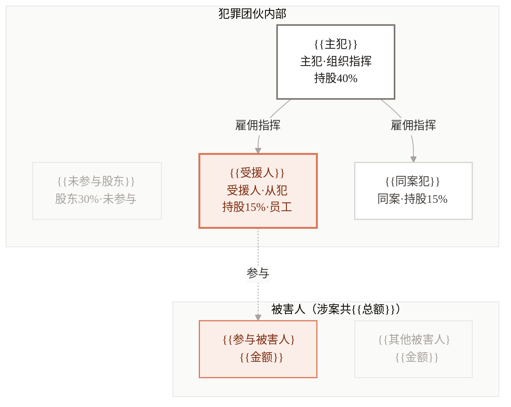
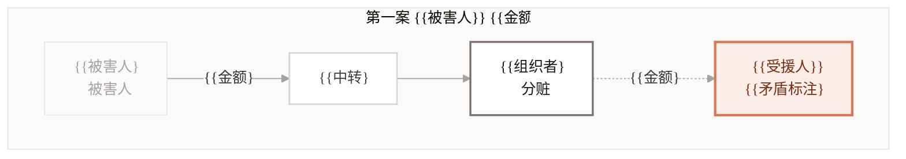
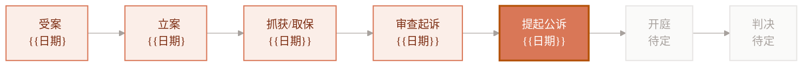

# Mermaid 节点连线图模板（关系图 / 资金流向 / 程序流程）

> 节点连线类图表用 Mermaid 自动布局，不手写 SVG 坐标。
> 本机已装 `mmdc`（mermaid-cli 11.x），渲染命令见末尾。
> 配色 = **Claude 橙白 · 方案A 极简克制**（2026-05-30 定为默认）：暖白底，受援人陶土橙是唯一焦点色，主犯/同案用暖灰退后。**禁止深色/黑色填充。禁止 Mermaid 默认鹅黄 subgraph 底**（必须在 init 里覆盖 `clusterBkg`）。

---

## 必备 init 头（每张图第一行，统一暖白主题）

```
%%{init: {'theme':'base','themeVariables':{'fontFamily':'PingFang SC, sans-serif','fontSize':'15px','clusterBkg':'#FAFAF9','clusterBorder':'#E7E5E4','edgeLabelBackground':'#FAFAF9','lineColor':'#A8A29E'}}}%%
```

> `clusterBkg:#FAFAF9` 是关键——不覆盖就会变成默认鹅黄脏底（历史踩坑）。

## 必备 classDef 尾（每张图末尾统一）

```
classDef leader fill:#FFFFFF,stroke:#78716C,stroke-width:2px,color:#1C1917;
classDef our    fill:#FBEEE8,stroke:#D97757,stroke-width:2.5px,color:#7C2D12;
classDef co     fill:#FFFFFF,stroke:#D6D3D1,stroke-width:1.5px,color:#44403C;
classDef mute   fill:#FAFAF9,stroke:#E7E5E4,stroke-width:1px,color:#A8A29E;
classDef vour   fill:#FBEEE8,stroke:#D97757,stroke-width:1.5px,color:#7C2D12;
```

角色→class 对照：受援人/己方 `our`（陶土橙，唯一焦点）；主犯/组织者 `leader`（白底深灰粗边，退后不抢橙）；同案犯 `co`（白底中灰）；无关方/未参与/其他被害人 `mute`（暖白浅灰，最弱）；受援人参与的被害人 `vour`（浅橙描边）。进度类（图8）用 `done/current/todo`，见下。

---

## 图表1：人物关系图谱



要点：受援人参与的指向线用虚线 `-.参与.->`（Mermaid 自动避让，不会压字）。

---

## 图表7：资金/财物流向图



多起案件 → 每起一个 subgraph 子图，不要全堆进一张。矛盾点写进受援人节点文字（如"供述900·差600"），不另设红块。

---

## 图表8：案件程序流程图

进度三态用专用 classDef：已完成浅橙底、当前阶段实心橙、待定暖白灰。



节点只放短标题+日期；期限审查、文书清单等长文字放到图下 HTML 说明区（用 light-card-table 的卡片），不塞进节点。

---

## 渲染命令

```bash
# 单图：mmdc 读 .mmd 出 PNG（白底，scale=4 保证中文清晰）
mmdc -i chart1.mmd -o chart1.png -b "#FFFFFF" -s 4

# 批量
for f in chart*.mmd; do mmdc -i "$f" -o "${f%.mmd}.png" -b "#FFFFFF" -s 4; done
```

**清晰度铁律：scale 必须用 `-s 4`，不要用 2。** 历史踩坑：`-s 2` 渲出的图嵌进 1467px 宽的 HTML 后，中文笔画发糊（尤其横向流程图节点被压扁时）。`-s 4` 输出约 3136px 宽，缩放到显示宽度后仍锐利。横向流程图（图8）即使整体很扁也照用横排 + `-s 4`，不要为清晰度改竖排（竖排会拉成瘦长条，不适合嵌入）。

渲染后把 PNG 与引用它的 HTML 放同一目录，再跑 `render_pixel_check.py` 或肉眼确认无黑块、无压字、文字清晰。Mermaid 自动布局已基本杜绝重叠，但节点文字过长仍可能撑大画布——超长文字务必用 `<br/>` 主动换行。
